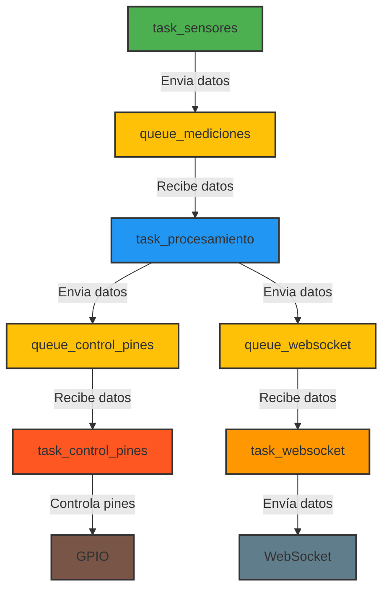

# agro-sensor-hub
Este repositorio contiene el código para leer todo el tiempo 4 sensores en cascada y enviarlos a una cola

```mermaid
graph TD;
    A[task_sensores] -->|Envia datos| B[queue_mediciones];
    B --> |Recibe datos| C[task_procesamiento];
    
    C -->|Envia datos| D[queue_control_pines];
    C -->|Envia datos| E[queue_websocket];

    D --> |Recibe datos| F[task_control_pines];
    E --> |Recibe datos| G[task_websocket];

    F --> |Controla pines| H[GPIO];
    G --> |Envía datos| I[WebSocket];
    
    style A fill:#4CAF50,stroke:#333,stroke-width:2px;
    style B fill:#FFC107,stroke:#333,stroke-width:2px;
    style C fill:#2196F3,stroke:#333,stroke-width:2px;
    style D fill:#FFC107,stroke:#333,stroke-width:2px;
    style E fill:#FFC107,stroke:#333,stroke-width:2px;
    style F fill:#FF5722,stroke:#333,stroke-width:2px;
    style G fill:#FF9800,stroke:#333,stroke-width:2px;
    style H fill:#795548,stroke:#333,stroke-width:2px;
    style I fill:#607D8B,stroke:#333,stroke-width:2px;
```