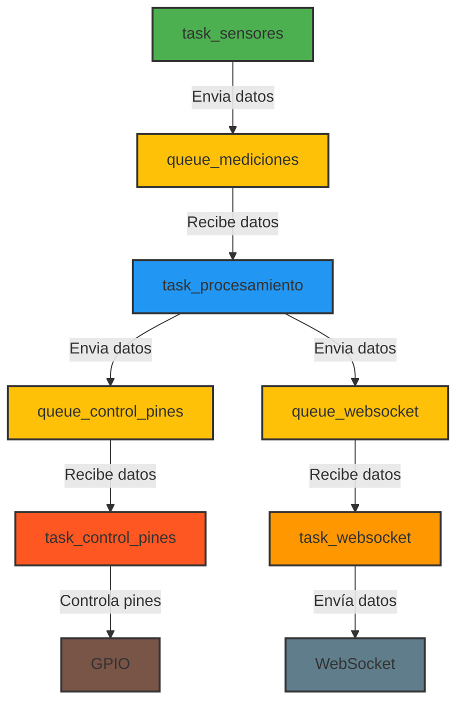

# agro-sensor-hub

Este repositorio contiene el código para un sistema de monitoreo de sensores que lee datos de cuatro sensores en cascada y los envía a diferentes colas para su procesamiento. El sistema está diseñado para funcionar con el microcontrolador ESP32 y utiliza FreeRTOS para la gestión de tareas.

## Funcionalidades

- **Lectura de Sensores**: El sistema puede leer datos de temperatura y humedad de sensores DHT y de humedad del suelo utilizando el sensor YL-69.
- **Procesamiento de Datos**: Los datos leídos se envían a una cola de mediciones, donde son procesados por una tarea dedicada.
- **Control de Pines**: Los datos procesados se envían a una cola de control de pines, que puede ser utilizada para activar o desactivar dispositivos conectados.
- **WebSocket**: Los datos también se envían a una cola de WebSocket para su transmisión a través de una conexión de red.

## Estructura del Proyecto

El proyecto está organizado en componentes, cada uno de los cuales tiene su propia funcionalidad. Los componentes principales incluyen:

- `taskProcessor`: Procesa los datos de los sensores.
- `taskSensores`: Lee los datos de los sensores.
- `pinController`: Controla los pines de salida.
- `webSocketHandler`: Maneja la comunicación a través de WebSocket.
- `queueManager`: Gestiona las colas de FreeRTOS.

## Diagrama de Flujo




## Cómo Usar

1. **Clonar el Repositorio**: Clona este repositorio en tu máquina local usando el siguiente comando:
   ```bash
   git clone https://github.com/tu_usuario/agro-sensor-hub.git
   ```

2. **Instalar Dependencias**: Asegúrate de tener el ESP-IDF instalado y configurado en tu entorno. Puedes seguir la [guía de instalación de ESP-IDF](https://docs.espressif.com/projects/esp-idf/en/latest/esp32/get-started/index.html).

3. **Configurar el Proyecto**: Navega al directorio del proyecto y ejecuta el siguiente comando para configurar el proyecto:
   ```bash
   idf.py menuconfig
   ```

4. **Compilar el Proyecto**: Compila el proyecto usando el siguiente comando:
   ```bash
   idf.py build
   ```

5. **Flashear el Proyecto**: Conecta tu ESP32 a la computadora y flashea el proyecto usando:
   ```bash
   idf.py -p (puerto) flash
   ```

6. **Monitorear la Salida**: Puedes monitorear la salida del ESP32 usando el siguiente comando:
   ```bash
   idf.py -p (puerto) monitor
   ```

## Contribuciones

Las contribuciones son bienvenidas. Si deseas contribuir, por favor abre un issue o un pull request.

## Licencia

Este proyecto está bajo la Licencia MIT. Consulta el archivo LICENSE para más detalles.